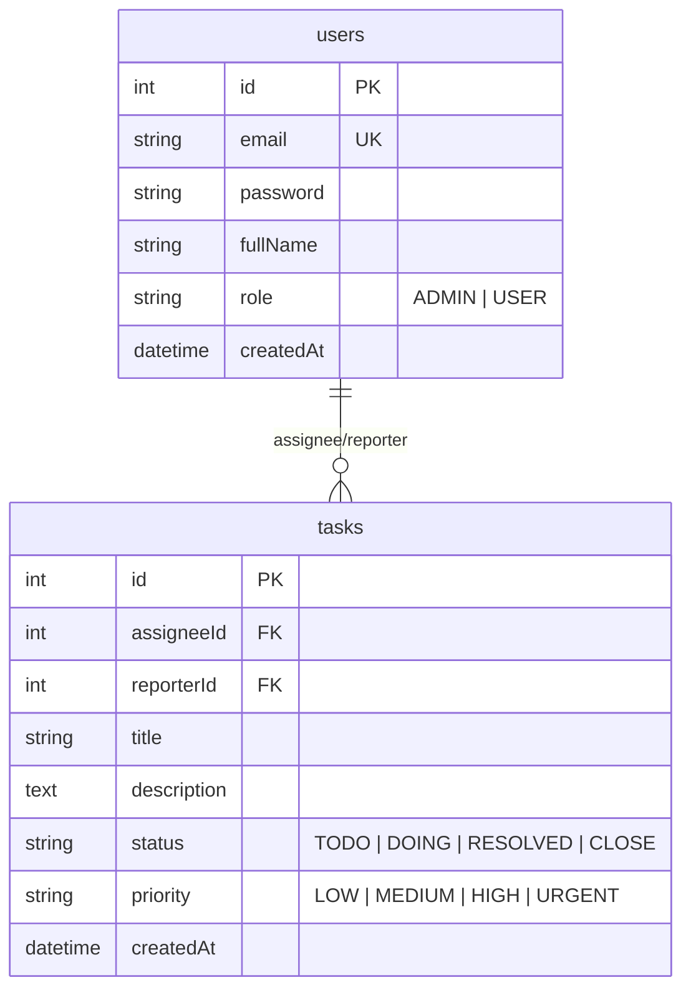

**Tuần 2: Database Modeling**

**Mục tiêu**

- Thiết kế ERD cho hệ thống basic (Users, Tasks)
- Viết Entity và Migration với TypeORM
- Hiểu quan hệ ManyToOne, OneToMany (User - Task)
- Kết nối PostgreSQL và chạy CRUD thành công

**Khởi tạo Database**

Để bắt đầu làm việc với database, chúng ta cần khởi tạo instance PostgreSQL bằng Docker:

```bash
docker compose up -d postgres
```

Lệnh này sẽ khởi chạy container PostgreSQL chạy ngầm dựa trên cấu hình trong file `docker-compose.yml`.

**ERD Diagram**



**Schema chi tiết**

- **users**: Lưu trữ thông tin định danh, phân quyền (ADMIN/USER) và thông tin cơ bản.
- **tasks**: Lưu trữ trạng thái công việc, độ ưu tiên và liên kết với User qua `assigneeId` và `reporterId`.

**TypeORM Entity (Source Code)**

```typescript
@Entity('tasks')
export class Task {
  @PrimaryGeneratedColumn()
  id: number;

  @Column()
  title: string;

  @Column({ type: 'text', nullable: true })
  description: string;

  @Column({ type: 'enum', enum: TaskStatus, default: TaskStatus.TODO })
  status: TaskStatus;

  @ManyToOne(() => User, (user) => user.assignedTasks)
  assignee: User;

  @ManyToOne(() => User, (user) => user.reportedTasks)
  reporter: User;

  @CreateDateColumn()
  createdAt: Date;

  @UpdateDateColumn()
  updatedAt: Date;
}
```

**Structure**

```
tm-backend/
├── src/
│   ├── config/
│   │   └── database.config.ts          # Cấu hình TypeORM
│   ├── modules/
│   │   ├── tasks/
│   │   │   ├── entities/
│   │   │   │   └── task.entity.ts      # Task Entity
│   │   │   └── tasks.service.ts        # CRUD với Repository
│   │   └── users/
│   │       └── entities/
│   │           └── user.entity.ts      # User Entity
├── docker-compose.yml                  # Docker config cho Postgres
└── .env                                # Database credentials
```

**Week 2 focus chính:**

- [x] Setup PostgreSQL với Docker
- [x] Configure TypeORM trong NestJS
- [x] Viết entities với relations (ManyToOne, OneToMany)
- [x] Implement full CRUD cho Tasks kết nối Database
- [x] Test API CRUD tasks với dữ liệu thật trong Postgres
- [x] Viết tài liệu `week2-database-modeling.md` với ERD Diagram
