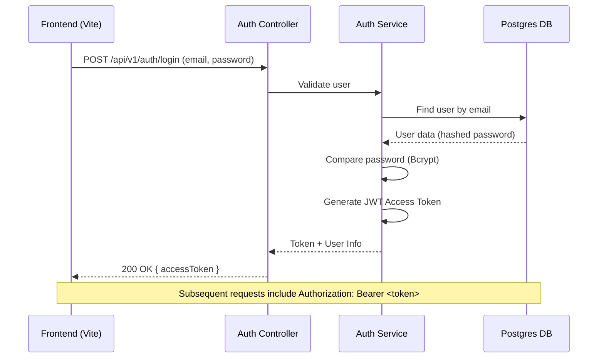

**Tuần 3: Logic & Security**

**Mục tiêu**

- Triển khai hạ tầng bảo mật với JWT (JSON Web Tokens) và Passport.js.
- Bảo mật API endpoints bằng Guards và Custom Decorators.
- Xây dựng logic phân quyền (Ownership) và máy trạng thái (State Machine) cho Task.
- Hỗ trợ API Versioning (v1/v2) và lọc dữ liệu (Filtering/Pagination).

**Luồng Authentication (JWT Flow)**



**Chi tiết kỹ thuật**

- **Security**: 
  - `Bcrypt`: Mã hóa mật khẩu 10 rounds trước khi lưu.
  - `JwtStrategy`: Giải mã token và gắn thông tin user vào `request.user`.
  - `@CurrentUser()`: Decorator giúp lấy user nhanh chóng trong Controller.
- **Task Logic**:
  - **Ownership**: Chỉ `Reporter`, `Assignee` hoặc `ADMIN` mới có quyền Update/Delete.
  - **State Machine**: Kiểm tra logic Status (Ví dụ: Không được nhảy từ TODO sang thẳng RESOLVED).
  - **Search/Pagination**: Hỗ trợ `?search=keyword&status=TODO&page=1&limit=10`.

**Structure Cập nhật**

```
tm-backend/
├── src/
│   ├── modules/
│   │   ├── auth/               # Module bảo mật mới
│   │   │   ├── dto/            # Login/Register DTOs
│   │   │   ├── guards/         # JwtAuthGuard
│   │   │   ├── strategies/     # JwtStrategy
│   │   │   ├── decorators/     # @CurrentUser()
│   │   │   ├── auth.controller.ts
│   │   │   └── auth.service.ts
│   │   ├── tasks/
│   │   │   ├── tasks.controller.ts # Thêm @UseGuards & @Query
│   │   │   └── tasks.service.ts    # Logic ownership & pagination
│   ├── main.ts                 # Cấu hình Versioning & CORS
├── .env.example                # Mẫu cấu hình môi trường mới
```

**Week 3 focus chính:**

- [x] Cài đặt Passport, JWT và Bcrypt dependencies
- [x] Implement Auth module (Login, Register, Logout)
- [x] Tạo `JwtAuthGuard` và `@CurrentUser` decorator
- [x] Bảo mật toàn bộ `TasksController`
- [x] Viết logic Ownership check trong `TasksService`
- [x] Hỗ trợ Phân trang & Tìm kiếm cho API lấy danh sách Task
- [x] Cấu hình API Versioning `v1` và bật CORS cho Frontend
- [x] Viết tài liệu `week3-auth-logic.md` theo chuẩn dự án
