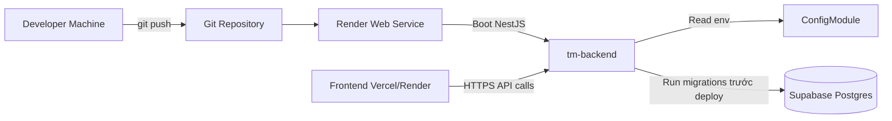

**Tuần 4: Docker, Migration & Deployment**

**Mục tiêu**

- Đóng gói `tm-backend` thành production container bằng Docker multi-stage.
- Tách rõ cấu hình môi trường cho local, Render và Supabase Postgres.
- Thiết lập migration-first workflow với TypeORM thay cho phụ thuộc vào `synchronize`.
- Chuẩn bị backend để deploy ổn định trên cloud service như Render.

**Production Flow**



**Chi tiết kỹ thuật**

- **Docker**
  - `Dockerfile`: Multi-stage build với `deps -> builder -> runner`.
  - Production image chỉ giữ `dist/` và production dependencies để giảm kích thước image.
  - Expose port `3001`, runtime dùng `node dist/main`.
- **Database & Migration**
  - `data-source.ts`: File riêng cho TypeORM CLI để chạy migration bằng command.
  - `migration:run`: Tạo schema `users`, `tasks`, enums và indexes trên PostgreSQL/Supabase.
  - `sql/001_create_users_and_tasks.sql`: SQL tương đương để chạy tay trong Supabase SQL Editor khi cần unblock nhanh.
- **Environment**
  - `DB_SSL` và `DB_SSL_REJECT_UNAUTHORIZED` cho phép toggle giữa local Postgres và Supabase.
  - `CORS_ORIGIN` và `CORS_CREDENTIALS` giúp cấu hình domain frontend theo môi trường deploy.
  - `NODE_ENV=production` sẽ tắt `synchronize`, vì production phải ưu tiên migration.
- **Deploy Strategy**
  - Backend deploy bằng `Render Web Service`.
  - Database dùng `Supabase Postgres` hoặc Postgres host tương đương.
  - Frontend gọi vào backend qua `VITE_API_BASE_URL`.

**Dockerfile (Production)**

```dockerfile
FROM node:20-alpine AS deps
WORKDIR /app
COPY package*.json ./
RUN npm ci

FROM node:20-alpine AS builder
WORKDIR /app
COPY --from=deps /app/node_modules ./node_modules
COPY . .
RUN npm run build

FROM node:20-alpine AS runner
WORKDIR /app
ENV NODE_ENV=production
COPY package*.json ./
RUN npm ci --omit=dev
COPY --from=builder /app/dist ./dist
EXPOSE 3001
CMD ["node", "dist/main"]
```

**Migration Commands**

```bash
# Xem migration status
npm run migration:show

# Chạy migration lên database hiện tại trong .env
npm run migration:run

# Revert migration gần nhất
npm run migration:revert

# Tạo migration rỗng mới
npm run migration:create

# Generate migration từ entity changes
npm run migration:generate
```

**Environment ví dụ cho Supabase / Render**

```env
PORT=3001
NODE_ENV=production

DB_HOST=aws-1-ap-southeast-2.pooler.supabase.com
DB_PORT=5432
DB_USERNAME=postgres.<project-ref>
DB_PASSWORD=<your-password>
DB_NAME=postgres
DB_SSL=true
DB_SSL_REJECT_UNAUTHORIZED=false

JWT_SECRET=<strong-secret>
JWT_EXPIRES_IN=7d

CORS_ORIGIN=https://your-frontend.vercel.app
CORS_CREDENTIALS=false
```

**Structure Cập nhật**

```
tm-backend/
├── src/
│   ├── config/
│   │   └── database.config.ts         # DB env + SSL flags
│   ├── database/
│   │   ├── database.module.ts         # TypeORM runtime config
│   │   ├── data-source.ts             # TypeORM CLI datasource
│   │   └── migrations/
│   │       ├── 1746700000000-CreateUsersAndTasks.ts
│   │       └── sql/
│   │           └── 001_create_users_and_tasks.sql
│   ├── main.ts                        # CORS + Versioning + ValidationPipe
│   └── modules/
│       ├── auth/
│       ├── tasks/
│       └── users/
├── Dockerfile                         # Backend production image
├── .dockerignore
├── .env.example
└── docs/
    ├── week1-data-flow.md
    ├── week2-database-modeling.md
    ├── week3-auth-logic.md
    └── week4-docker-deployment.md
```

**Week 4 focus chính:**

- [x] Viết `Dockerfile` multi-stage cho backend
- [x] Thêm `.dockerignore` để tối ưu image build
- [x] Hỗ trợ SSL config cho PostgreSQL/Supabase qua env
- [x] Thêm `CORS_ORIGIN` và `CORS_CREDENTIALS` vào bootstrap
- [x] Setup TypeORM `data-source.ts` cho CLI
- [x] Tạo migration đầu tiên cho `users` và `tasks`
- [x] Thêm SQL fallback để chạy trực tiếp trên Supabase SQL Editor
- [x] Chuẩn bị backend để deploy trên Render với Supabase
- [x] Viết tài liệu `week4-docker-deployment.md`
